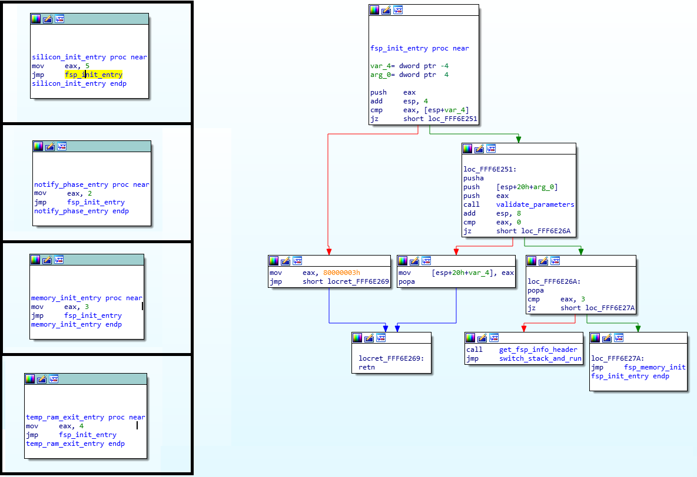
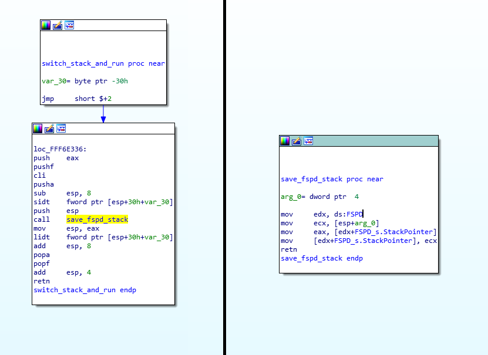
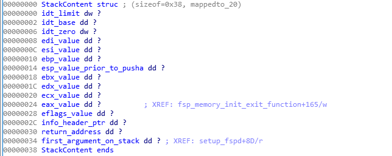
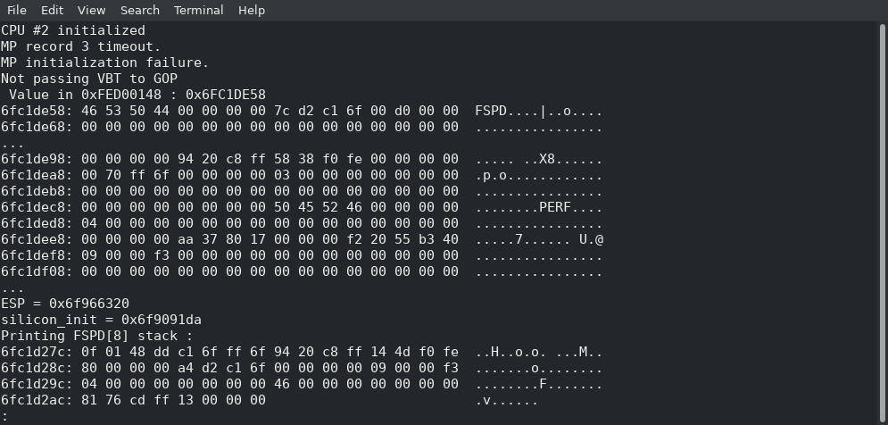
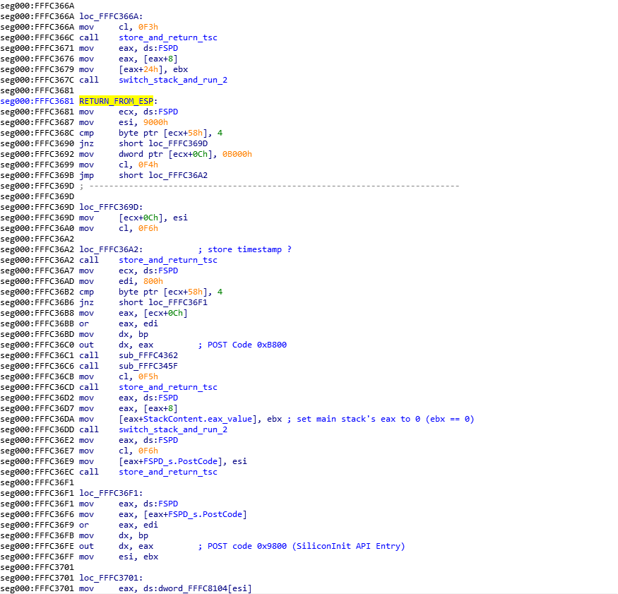
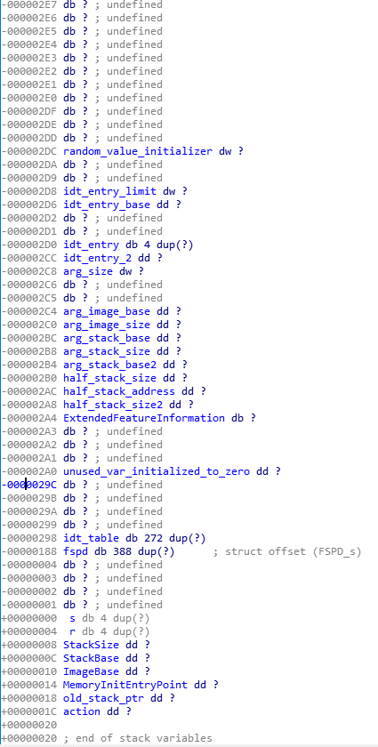
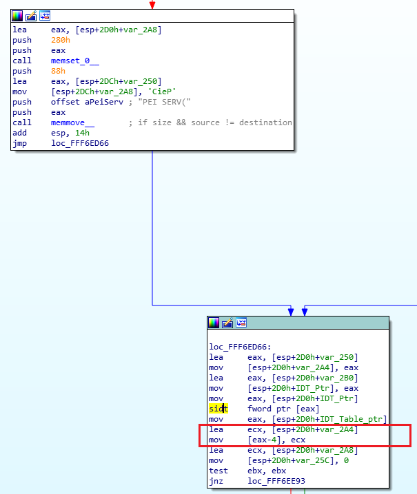
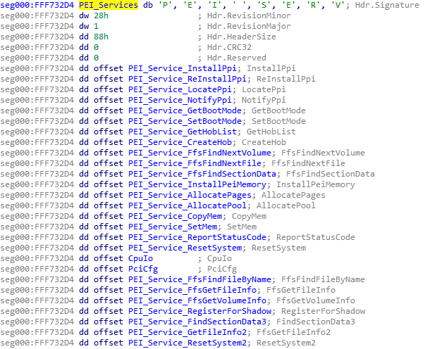
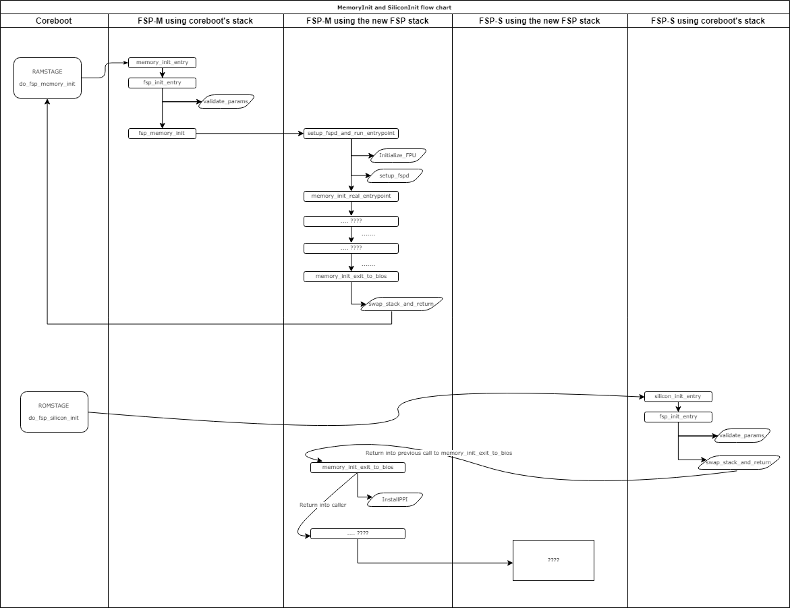
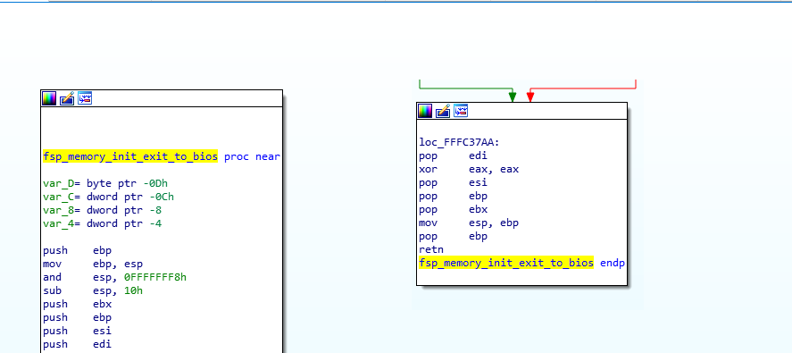

April 2, 2018

Intel FSP reverse engineering: finding the real entry point!
============================================================

-   [About](https://archive.is/o/keCad/https://web.archive.org/web/20180421130128/https://puri.sm/posts/intel-fsp-reverse-engineering-finding-the-real-entry-point/%23abh_about)
-   [Latest Posts](https://archive.is/o/keCad/https://web.archive.org/web/20180421130128/https://puri.sm/posts/intel-fsp-reverse-engineering-finding-the-real-entry-point/%23abh_posts)

### [Youness Alaoui](https://archive.is/o/keCad/https://web.archive.org/web/20180421130128/https://puri.sm/posts/author/_kakaroto/)

Hardware enablement developer

Hi everyone, it’s time for another blog post from your favorite Purism Reverse Engineer (that’s me! ’cause I’m the only one…)!

After attending 34C3 in Leipzig at the end of December, in which we (Zlatan and me) met with some of you, and had a lot of fun, I took some time off to travel Europe and fall victim to the horrible Influenza virus that so many people caught this year. After a couple more weeks of bed rest, I continued my saga in trying to find the **real** entry point of the Intel FSP-S module.

**WARNING**: This post will be *very* technical, and even if you are a technical person, you will probably need to have read my previous “[Primer guide](https://archive.is/o/keCad/https://web.archive.org/web/20180421130128/https://puri.sm/posts/primer-to-reverse-engineering-intel-fsp/)” blog post in order to be able to follow most of it. If however, you’re not a technical person, don’t worry, here’s the non-technical executive summary:\* I made some good progress in reverse engineering both the FSP-S and FSP-M and I’m very happy with it so far

-   Unfortunately, all the code I’ve seen so far has been about setting up the FSP itself, so I haven’t actually been able to start reverse engineering the actual Silicon initialization code.
-   This blog post is about finding the “real entry point”, the real silicon initialization code and I’ve been jumping through a lot of hoops in how the FSP initializes itself in an attempt to find where it actually does start the initialization code and I believe I’m very close to finding it.
-   Progress is good and still ongoing, and the task will be done at some point, so stay patient as you have been so far.
-   This post is mostly about going step by step over the process of reverse engineering that I’ve done so far. It helps you follow along on the progress, helps some of you learn how it’s done and what happens behind the scenes.

Diving back into the depths
===========================

If you remember, in my [primer to reverse engineering the FSP](https://archive.is/o/keCad/https://web.archive.org/web/20180421130128/https://puri.sm/posts/primer-to-reverse-engineering-intel-fsp/), I said the following :

“I’ve finished reverse engineering the FSP-S entry code—from the entry point (FspSiliconInit) all the way to the end of the function and all the subfunctions that it calls. This only represents 9 functions however, and about 115 lines of C code; I haven’t yet fully figured out where exactly it’s going in order to execute the rest of the code. What happens is that the last function it calls (it actually jumps into it) grabs a variable from some area in memory, and within that variable, it will copy a value into the ESP, thus replacing our stack pointer, and then it does a ‘RETN’… which means that it’s not actually returning to the function that called it (coreboot), it’s returning… somewhere, depending on what the new stack contains, but I don’t know where (or how) this new stack is created, so I need to track it down in order to find what the return address is, find where the RETN is returning us into, so I can unlock plenty of new functions and continue reverse engineering this.”

Today, we will examine what happens in more details. Get ready for the technical part now, because we’re going to dive right back in, and we’re going to go pretty deep as I walk you through the steps I took to reverse engineer that portion of the code to figure out what happens. I’ll go pretty fast over things like “look at this ASM function, this is what it does” because you don’t need the details; I’ll mostly explain the weird/unusual/non-straightforward things.

First, a little preface: there are two FSP files, the FSP-M and FSP-S. The FSP-M contains the functions for the memory initialization and the FSP-S contains the functions for the silicon initialization. Coreboot will run the MemoryInit from FSP-M during its r*omstage*, then once the RAM is initialized, it will start its *ramstage *in which it will run the SiliconInit function from the FSP-S file.

The FSP-S file is loaded into memory by coreboot, then the address of the ‘*SiliconInit*‘ function is retrieved from the FSP-S file header and coreboot calls that function. That function is pretty simple, it just calls the ‘*fsp\_init\_entry*‘ function (that’s how I called it). Actually, all of the FSP entry point functions will call this same *fsp\_init\_entry()* but will set %eax to a different value each time, to represent which FSP entry point function was called. See for yourselves:

Note that in the FSP-S file, the ‘*jmp fsp\_memory\_init*‘ (in the lower-right corner) is replaced with ‘*jmp infinite\_loop*‘ instead. This screenshot was actually taken from the FSP-M file, which is why it shows “*jmp fsp\_memory\_init*“.

So, each of the entry points in the various FSP images (on the left, I showed entry points for both FSP-S and FSP-M files) will call *fsp\_init\_entry* which will call *validate\_parameters*() and then if the %eax register is 3 (you’ll notice that’s the value set by *memory\_init\_entry*), it will call *fsp\_memory\_init*, otherwise it will jump into *switch\_stack\_and\_run *(after calling *gst\_fsp\_info\_header*, you’ll see why below). All that the *switch\_stack\_and\_run*() function does is to replace the stack pointer (first storing all of the registers into it and replacing all the register values from ones taken from the new stack), then finally return. See for yourselves:

It might *look* complicated, but it’s not that much:\# it does a bunch of ‘[push](https://archive.is/o/keCad/https://web.archive.org/web/20180421130128/https://x86.puri.sm/html/file_module_x86_id_269.html)‘, the first is to push %eax, which is the return value from the previous “[call](https://archive.is/o/keCad/https://web.archive.org/web/20180421130128/https://x86.puri.sm/html/file_module_x86_id_26.html) *get\_fsp\_info\_header*” call in the *fsp\_init\_entry* function above,

1.  then it calls ‘[pushf](https://archive.is/o/keCad/https://web.archive.org/web/20180421130128/https://x86.puri.sm/html/file_module_x86_id_271.html)‘ which pushes the EFLAGS register,
2.  then “[cli](https://archive.is/o/keCad/https://web.archive.org/web/20180421130128/https://x86.puri.sm/html/file_module_x86_id_31.html)” will disable interrupts (this is to avoid having some interrupt triggered and change things from under our noses),
3.  then ‘[pusha](https://archive.is/o/keCad/https://web.archive.org/web/20180421130128/https://x86.puri.sm/html/file_module_x86_id_270.html)‘ which will push all of the registers into the stack,
4.  then we subtract 8 bytes from the stack, basically allocating 8 bytes,
5.  then calling ‘[sidt](https://archive.is/o/keCad/https://web.archive.org/web/20180421130128/https://x86.puri.sm/html/file_module_x86_id_295.html)‘ which is “Store Interrupt Descriptor Table”.
6.  Finally it calls ‘*save\_fspd\_stack*‘ and it gives it the %esp (stack pointer) as argument. That function will store that argument into offset 8 of the address stored in 0xFED00148… but since I already reversed that, let’s make it easier for you and just say that it stored the argument in the StackPointer field (offset 0x08) of the FSPD data structure,
7.  then return in %eax the previous value that was stored there.
8.  *switch\_stack\_and\_run* will store the returned address into %esp, effectively replacing the entire stack,
9.  then it will proceed to [pop](https://archive.is/o/keCad/https://web.archive.org/web/20180421130128/https://x86.puri.sm/html/file_module_x86_id_248.html) back all the registers, flags, IDT back into their respective places,
10. then return which will make us return not into the *fsp\_init\_entry* function (nor to coreboot since fsp\_init\_entry actually did a ‘[jmp](https://archive.is/o/keCad/https://web.archive.org/web/20180421130128/https://x86.puri.sm/html/file_module_x86_id_147.html)‘, not a ‘[call](https://archive.is/o/keCad/https://web.archive.org/web/20180421130128/https://x86.puri.sm/html/file_module_x86_id_26.html)‘), but rather it returns to whatever was the return address of the calling function from the new stack pointer.

This is what I explained in my previous blog post (which I quoted at the beginning of this post).

To make things easier to visualize for you, here’s a description of the stack contents (as an IDA structure):

In the picture above: you’ll notice that of course, the top of the stack contains the last thing that was pushed into it, and the ‘dd’ means ‘data double word’ (4 bytes) and ‘dw’ means ‘data word’ (2 bytes) so you’ll see the ‘idt\_’ values at the top of the stack represent 8 bytes (2 + 4+ 2) because as the ‘[sidt](https://archive.is/o/keCad/https://web.archive.org/web/20180421130128/https://x86.puri.sm/html/file_module_x86_id_295.html)‘ instruction describes, the IDT is made up of 6 bytes, the limit (2 bytes) and the base address (4 bytes). You may also notice the ‘*first\_argument\_on\_stack*‘, that’s because the *silicon\_init* was called with an argument (UPD configuration structure) and that was initially on the stack and still is on the stack when the stack exchange occurs.

If you want to see the C code equivalent that I wrote when reverse engineering these functions, head over to the new [git repository](https://archive.is/o/keCad/https://web.archive.org/web/20180421130128/https://code.puri.sm/kakaroto/FSP) I created for this project. This code is common to both FSP-S and FSP-M and so it’s available in the [fsp\_common.c](https://archive.is/o/keCad/https://web.archive.org/web/20180421130128/https://code.puri.sm/kakaroto/FSP/src/master/fsp_common.c) file.

I’m FED00148 up
===============

So now, the big question! I had no idea what’s in this “0xFED00148” address (the one you saw as ‘ds:FSPD’ above) or who sets its content, or what it contains. I eventually figured out it’s the “FSP DATA” structure and I know what some of its fields are (such as the Stored StackPointer at offset 8), but at first, I had no idea, so here’s what I did: I dumped the content of the 0xFED00148 address from coreboot *prior to* calling SiliconInit, that gave me the address of the FSPD structure and at offset 8, I found the new stack pointer that the FSP-S will use, and from there, I manually popped the values until I found the new return address.

Thanks to my previous StackContents structure, we already know that the return address is at offset 0x30 in the saved stack, so in the above coreboot console output, we see the return address value is 0xffcd7681 (what you see as “81 76 cd ff” above, because x86 stores data in [Little-Endian](https://archive.is/o/keCad/https://web.archive.org/web/20180421130128/https://en.wikipedia.org/wiki/Endianness%23Little), that means the bytes are read right to left), and that doesn’t match anything in the FSP-S since we can see that the *silicon\_init* function is at 0x6f9091da and offset 0xffcd7681 is way beyond the boundaries of the FSP-S file. However, I thought of also printing the offset of the FSP-M file when MemoryInit was being called and the result was: 0xffc82000. That’s a lot more likely to mean that the return will return into a function of the FSP-M file instead, more specifically 349 825 bytes inside the FSP-M file (0xffcd7681 – 0xffc82000 = 0x55681 = 349825).

This also makes more sense because since we just loaded the FSP-S into RAM, and we haven’t called *silicon\_init* yet, that means this FSPD data structure at 0xFED00148 must have been set up by something else, and since coreboot doesn’t know anything about it, it’s obvious that the FSP-M is the one that actually creates and initializes that FSPD data structure. The only ‘safe’ return value that FSP-M knows has to be a function within itself since it doesn’t know yet where FSP-S is loaded into memory.

Jumping through our first hoop
==============================

If I go to that return address in IDA, I find an ‘uncharted territory’, meaning that IDA did not think this contained code because no function called into this place, but by pressing ‘c’, I transform it into code, then I go back up and do it again and convert another portion of data into code until I found the “function signature” of most functions (called the function prologue which amounts to “*push ebp; mov ebp, esp*“) telling me it’s the start of the function, then I pressed the ‘p’ key to tell IDA to transform this into an actual function and success, I got a function disassembled by IDA which contains our return value. Since the FSP-M is supposed to be loaded at 0xFFF6E000, with the 0x55681 offset, that means that we return into address 0xFFFC3681 and I made a label there and called it *“RETURN\_FROM\_ESP”* as you can see below, and the interesting thing is that the assembly line right above it is a “*call switch\_stack\_and\_run\_2*” which is actually another function that contains the exact same code as the ‘*switch\_stack\_and\_run*‘ we saw before (it happens often that functions are duplicated in the code).

This makes sense because this means that this is the last function of the FSP-M. After the Memory Initialization is done, it calls switch\_stack\_and\_run and that causes it to stores its current state (registers, stack, return address) in the FSPD data structure then return into coreboot, and when we call the *silicon\_init* and it also calls *switch\_stack\_and\_run* it reverts the stack and registers to what it was and the execution continues in this function. It’s pretty weird and convoluted, I know…

So yay, I found where the FSP-S returns into, it’s in this function in FSP-M, now I need to figure out what this does and how it knows where to find the **real** entry point from FSP-S and how it calls it. So I reverse engineered it (starting at that offset, I don’t care about what happens before) and it was a fairly big/complicated function which translates roughly into the following C code:

 

// This starts at the middle of the exit function of FSP-M. This is what gets called (returned into) // when TempRamExit or SiliconInit get called. EFI\_STATUS into\_new\_stack\_retvalue() {

` FSP_DATA *fsp_data = *FSP_DATA_ADDR;`
` char last_tsc_byte;`
` uint32_t fixed_mtrrs[0xB] = {0x250, 0x258, 0x259, 0x268, 0x269, 0x26A, 0x26B, 0x26C,`
`                              0x26D, 0x26E, 0x26F};`

` if (fsp_data->Action == FSP_ACTION_TEMP_RAM_EXIT) {`
`   fsp_data->PostCode = 0xB000; // TempRamInit POST Code`
`   last_tsc_byte = 0xF4;`
` } else {`
`   fsp_data->PostCode = 0x9000; // SiliconInit POST Code`
`   last_tsc_byte = 0xF6;`
` }`

` store_and_return_tsc(last_tsc_byte);`

` if (fsp_data->Action == FSP_ACTION_TEMP_RAM_EXIT) {`
`   post_code(fsp_data->PostCode | 0x800); // 0xB800 TempRamInit API Entry`
`   sub_C4362();`
`   sub_C345F();`
`   store_and_return_tsc(0xF5);`
`   fsp_data->StackPointer[0x24] = 0; // Set eax in the old stack`
`   swap_esp_and_fsp_stack();`
`   fsp_data->PostCode = 0x9000; // SiliconInit POST Code`
`   store_and_return_tsc(0xF6);`
` }`
` post_code(fsp_data->PostCode | 0x800); // 0x9800 SiliconInit API Entry`

` int mtrr_index = 0;`
` while (rdmsr(fixed_mtrr[mtrr_index]) == 0) {`
`   mtrr_index++;`
`   if (mtrr_index >= 0xB) {`
`     int mtrrcap = rdmsr(IA32_MTRRCAP); // 0xFE;`
`     int num_mttr = (mtrrcap & 0xFF) * 2;`

`     if (num_mttr) {`
`       mttr_index = 0;`
`       do {`
`         if (rdmsr(0x200 + mttr_index) == 0)`
`           break;`
`         mttr_index++;`
`         if (mttr_index >= num_mttr) {`
`           sub_C345F();`
`         }`
`       } while(mtrr_index < num_mtrr);`
`     } else{`
`       sub_C345F();`
`     }`
`   }`
` }`

` info_header = fsp_data->StackPointer[0x2C];`
` if (info_header.Signature != 'FSPH')`
`   info_header = fsp_data->InfoHeaderPtr;`

` void *ptr = info_header.ImageBase;`
` upper_limit = info_header.ImageBase + info_header.ImageSize - 1;`

` while (ptr < upper_limit && ptr[0x28] == '_FVH') {`
`   uint32_t guid[] = {0x1B5C27FE, 0x4FBCF01C, 0x1B34AEAE, 0x172A992E};`

`   if (*(uint16_t *)&ptr[0x34] != 0 && compare_guid(ptr+*(uint16_t *)&ptr[0x34], guid) != 0) {`
`     weird_function(ptr, ptr[0x20]);`
`   }`
`   ptr += ptr[0x20];`
` }`
` return 0;`

}

It’s pretty long code but relatively easy to understand. Step by step:\# It will check if the action value stored in the FSPD data structure at 0xFED00148 is 4 or 5 (remember the “mov %eax, 5” in *silicon\_init* and and “mov %eax, 4” in *temp\_ram\_exit* before *fsp\_init\_entry* gets called). Since all the registers/stack/etc. get restored, that explains why all the data we need to keep across stack exchanges needs to be stored in this FSPD data structure, and yes, that %eax value from *fsp\_init\_entry* gets stored in the FSPD (during *validate\_parameters*).

1.  It then sets the PostCode variable in FSPD to either 0xB000 or 0x9000 (which matches the first nibble of the TempRamInit and SiliconInit POST codes),
2.  It checks if it is TempRamInit, then it does a post\_code(0xB800) and does a bunch of stuff that I didn’t bother to reverse because I’m not interested in that, then it calls again the switch\_stack\_and\_run\_2 (which I renamed “swap\_esp\_and\_fsp\_stack” in the C code). This means that TempRamInit will exit back into the old saved stack, thus it returns into coreboot, and right after that, if we call back into the FSP, it will continue its process from this spot, expecting it to be a SiliconInit that called it.
3.  It sends the Post code 0x9800 (SiliconInit API Entry),
4.  then it will loop looking for an available MTRR, it will check the MTRRs 0x250, 0x258, 0x259, 0x268, etc.. basically, the first available MTRR from IA32\_MTRR\_FIX64K\_00000 to IA32\_MTRR\_FIX4K\_F8000.
5.  If none are available, then it will look for the number of available MTRR using the IA32\_MTRRCAP and loop for them until it finds an available one.
6.  If it can’t find one, it calls a function that I didn’t bother to reverse yet.
7.  It checks the image’s base address and looks for the ‘\_FVH’ signature (EFI File Volume Header) and the GUID of the FSP-S file
8.  Finally, it then calls a “weird function”.

What is this weirdness you speak of?
====================================

The *‘weird\_function’* itself isn’t so weird, it does a bunch a rather simple stuff, but in which it calls a couple of actually small and weird functions which makes the entire function impossible to understand. What are these small weird functions? Let’s start with the code itself, and we’ll let it speak for itself:

For those of you who paid attention, this function is calling into an offset of a register (%edx+0x18). So far, that’s not too bad, we often see that (function pointers in a structure are common), the problem is… “Where does this %edx register come from? Oh, it’s the content of the %eax register (the line above). Where does %eax come from? It comes from the content of the \[%eax-4\] pointer… and where does this %eax come from? Well it comes from *var\_A*, which itself is not modified anywhere in the code…” However, if we look at the code in its entirely, we see that there is a ‘[sidt](https://archive.is/o/keCad/https://web.archive.org/web/20180421130128/https://x86.puri.sm/html/file_module_x86_id_295.html)‘ instruction there, which stores the IDT (Interrupt Descriptor Table) into the pointer pointed to by %eax which itself comes from *var\_4* which itself contains the value of %eax which itself is the address of *var\_C*…

So… to simplify, the IDT is stored in var\_C, then %eax is taken from var\_A (2 bytes into var\_C since the stack grows upside down). This means that at this point %eax contains the address of the IDT address, then the function subtracts 4 from the address and grabs the pointer pointed to by that address… then it takes the value pointed to by that pointer and add 0x18 to it and that’s your function pointer. Maybe the function with comments will make it a little less confusing:

So the really weird thing here is that our “function pointer stored in a structure” actually comes from a pointer to a structure that is stored 4 bytes before the Interrupt descriptor table for some magical (or stupid?) reason.

Now that I got there, I felt stuck because I had absolutely no idea what that function is, and while I could have used my previous dump of the stack to figure it out (remember, the IDT was also stored on the stack when the stacks get swapped), I would just get some pointer to a function but I needed to actually understand why it used the \[IDT-4\] and how the FSP DATA was setup, etc. so I decided to temporarily give up on the Silicon Init and actually start reverse engineering the setup part of the MemoryInit function instead.

Starting from scratch
=====================

So, I started again from scratch and I reverse engineered the FSP-M setup code. It was very similar to the FSP-S code, the only difference is that if the action == 3 (MemoryInit), instead of calling the ‘*infinite\_loop*‘ function, it was calling the *fsp\_memory\_init* function.

The *fsp\_memory\_init* function is a rather simple function that does one small thing: it creates a new stack! Ha, that explains so much. It turns out the *MemoryInit* function’s UPD configuration has a *FspmArchUpd.StackBase* and *FspmArchUpd.StackSize* configuration options that define the address and size of the stack to setup. So the entire FSP-M will run into its own stack and so it leaves the coreboot/BIOS’s stack intact. The FSP-S also needs to run from this stack, which is why when it swaps into it, we end up in FSP-M, because that’s where it last was when it swapped out of it. Great, what next?

The next thing the *fsp\_memory\_init* does is to call a function I named *setup\_fspd\_and\_run\_entrypoint*. What that function does is to setup the FSPD structure (the one at 0xFED00148), and I thought that by understanding how that gets setup, I would understand all I needed, but that’s not the case, it just does a bunch of complicated things, such as:\# get the ExtendedFeature information of the CPU using the *cpuid *instruction, but then it ignores the result,

1.  it then loops a bunch of time calling the *rdrand* instruction to generate random data until it actually generates data (so, I assume it initializes the random number generator by poking it until it gives it something),
2.  then it initiliazes the FPU,
3.  sets some unused variable on the stack to 0,
4.  then creates an IDT entry using the values 0x8FFE4 and 0xFFFF8E00 (which means an IDT to offset 0xFFFFFFFE4 (0x100000000 – 0x1C) with GDT selector 8 and type attributes 0x8E, meaning it’s a 32 bit interrupt gate that is present), then it replaces the Interrupt offset to 0x1C bytes before the end of the FSP-M file (which is all just full of 0xFF bytes, so it’s not a valid function address).
5.  It will then copy that IDT entry 34 times, then it sets the IDT to that pointer with the ‘[lidt](https://archive.is/o/keCad/https://web.archive.org/web/20180421130128/https://x86.puri.sm/html/file_module_x86_id_156.html)‘ instruction.
6.  It then calls another function that actually sets up the FSPD by giving it a pointer to its own stack,
7.  then it creates a structure that it fills with a bunch of arguments and calls this ‘entrypoint’ with that structure as argument.

So, the stack of this *setup\_fspd\_and\_run\_entrypoint* is pretty big, it’s about 0x300 bytes. Inside it, we find all of the local variables of this function, such as the FSP DATA structure itself, and the IDT table as well. Thankfully, IDA has a neat feature where you can look at the stack of a function by showing you where in the stack its arguments would be and where its local variables are. Here’s what it looks like for our function:

You can see the idt\_table at -0x298, and you can see 4 bytes before it, at-0x29C, there is only undefined data, which means that area of the stack was not modified anywhere in this function. Well that’s not very helpful… So I continued reverse engineering the other sub functions that it calls, which actually initializes the FSPD structure and fills it out, I understood what it’s used for, but still: no idea about this \[IDT-4\] issue. I didn’t want to enter the entrypoint function, or what I assumed was the MemoryInit real entry point, since its function pointer was given as argument to the function I called *setup\_fspd\_and\_run\_entrypoint*. After I was done reversing all of the setup code, I had no choice but to enter the function I called the ‘entrypoint’ and after looking at it rather quickly I find this little gem:

The structure is found!
=======================

I had now finally found the function that calls the sidt instruction to retreive the IDT address and then write the pointer we’re looking for in \[IDT-4\]; it is indeed a pointer to a pointer as you can see, we store the address of var\_2A4 which itself contains the address to var\_250, and we can see just above that var\_250 gets 0x88 bytes copied into it from a string “PEI SERV(“. If I go to that address, I realize that it’s a structure of size 0x88 and that “PEI SERV” looks like an 8 byte signature at the start of the structure. Searching for what “PEI SERV” means, I find that it’s indeed the signature to a 0x88 sized structure from the UEFI PEI Specification. The bytes that follow specify the major and minor revision of the spec it follows, which is 1.40 in our case, and that turns out to be the specification from the [UEFI Platform Initialization Specification Version 1.4 (Errata A)](https://archive.is/o/keCad/https://web.archive.org/web/20180421130128/http://www.uefi.org/sites/default/files/resources/PI_1_4_ErrataA.zip). Once I knew that, I was able to follow the specification, define the structure, and rename these unknown functions into their actual function names, and I got this:

And thus, the previous “what is this” function that we saw, with its \[edx+0x18\] access, became a very simple function that calls the InstallPpi UEFI API function. So yeah, the FSP-M is simply going to do an InstallPpi on the entire FSP-S image, then return back into whoever called that function that the FSP-S jumped back into…

The ‘*weird\_function*‘ translates into this :

void install\_silicon\_init\_ppi(void \* image\_base, int image\_size) {

` uint32_t *Ppi = AllocatePool_and_memset_0(0x20);`
` uint32_t *PpiDescriptor;`
` uint8_t SiliconPpi_Guid[16] = {0xC1, 0xB1, 0xED, 0x49,`
`                                0x21, 0xBF, 0x61, 0x47,`
`                                0xBB, 0x12, 0xEB, 0x00,`
`                                0x31, 0xAA, 0xBB, 0x39};`

` Ppi[0] = 0x8C8CE578;`
` Ppi[1] = 0x4F1C8A3D;`
` Ppi[2] = 0x61893599;`
` Ppi[3] = 0xD32DC385;`
` Ppi[4] = image_base;`
` Ppi[5] = image_size;`
` PpiDescriptor = AllocatePool(0xC);`
` PpiDescriptor[0] = 0x80000010; // Flags`
` PpiDescriptor[1] = SiliconPpi_Guid;`
` PpiDescriptor[2] = Ppi;`
` return InstallPpi(&PpiDescriptor);`

}

You can also see the use here of AllocatePool which is another one of the PEI\_Services API calls (which itself just calls the API CreateHob), and I’m glad I didn’t have to reverse engineer the entire memory allocation code to figure out that function simply allocates memory for us.

So that’s it, I’ve reverse engineered the entire FSP-S entry code, most of the FSP-M initialization code, and I then jumped back into the end/exit function of the FSP-M code (which itself does some small MTRR initialization then Installs the FSP-S as an UEFI Ppi then returns “somewhere”).

By the way, a “PPI” is a “PEIM-to-PEIM Interface” and “PEIM” means “PRE-EFI Initialization Module”. So now, I have to figure out how the PPI gets installed, and more specifically, how it gets used later by the FSP-M code, and who calls that function that exits the MemoryInit and handles the FSP-S return-from-new-stack behavior.

To try to explain “what’s going on in there” in a simple manner, here is my attempt at a flowchart to summarize things:

The big remaining unknown is the questionmark boxes at the bottom of the flow chart. More specifically, we need to figure out who called *memory\_init\_exit\_to\_bios* and how the PEIM gets installed and executed.

You can see the full reverse engineering of that section of the code in the [fsp\_m.c](https://archive.is/o/keCad/https://web.archive.org/web/20180421130128/https://code.puri.sm/kakaroto/FSP/src/master/fsp_m.c) and [fsp\_m\_init.c](https://archive.is/o/keCad/https://web.archive.org/web/20180421130128/https://code.puri.sm/kakaroto/FSP/src/master/fsp_m_init.c) files in my FSP code repository.

Next steps
==========

At this point, I’m sort of stuck because I need to find who called memory\_init\_exit\_to\_bios, and to do that, I think I’m going to dump the entire stack from within coreboot, both before and after SiliconInit is executed, then use the saved register value of ebp, to figure out the entire call stack. See, most functions do this when they are entered:

push ebp mov ebp, esp sub esp, xxx

This stores the %ebp into the stack (right after the return address), then copies the %esp into the %ebp register. This means that throughout the entire function, the %ebp register will always point to the beginning of the stack at the start of the function, and can be used to access variables in an easy way. But also, the end of the function will look like this:

mov esp, ebp pop ebp retn

This will restore the stack pointer to what it was, then pop %ebp before returning. This is very practical if you don’t want to keep track of how many variables you pushed and popped, or how many bytes you allocated on the stack for local variables (and it’s also faster/more optimized of course than an ‘add’ to %esp).

Here’s a real example in the memory\_init\_exit\_to\_bios function:

On the left, you see the begining of the function (the prologue), and on the right, the end of the function (the epilogue), you can see how it stores %ebp, then puts %esp into it, then stores the registers it will need to modify (%ebx, %ebp, %esi and %edi) within this function, then at the end, it restores the registers, then the stack. You can see this same pattern in our previous ‘*weird\_function*‘ screenshot as well.

This means that the stack will usually look like this:

data … previous ebp return address data … previous ebp return address etc.

The only thing is that every ‘previous ebp’ will point to the begining of the stack of the calling function, which will itself be the address in the stack of the ‘previous ebp’. So in theory, I could follow that up all the way to the top, finding the return address of each function that called me, thus building a stack trace like what gdb gives you when you crash your program (that’s actually how gdb does it). Hopefully with that, I’ll get the full trace of who called the memory\_init\_exit\_to\_bios function, but also, if I do it after the execution of SiliconInit, I would get the entire trace of the SiliconInit entrypoint all the way to its own version of the silicon\_init\_exit\_to\_bios, and hopefully that will help me get exactly what I need.

The other nice thing is that now it’s all probably going to be done via API calls to a UEFI Module and using API interfaces for the PEIM, and using PPI and whatnot, so I will also need to start learning about UEFI and how it works internally, but the nice thing is that it will probably help me reverse engineer more easily, since the API names and function signatures will be known.

Then, once I know what I need to know, I can finally start reverse engineering the actual silicon initialization code. *Talk about jumping through hoops to find the front door!*
