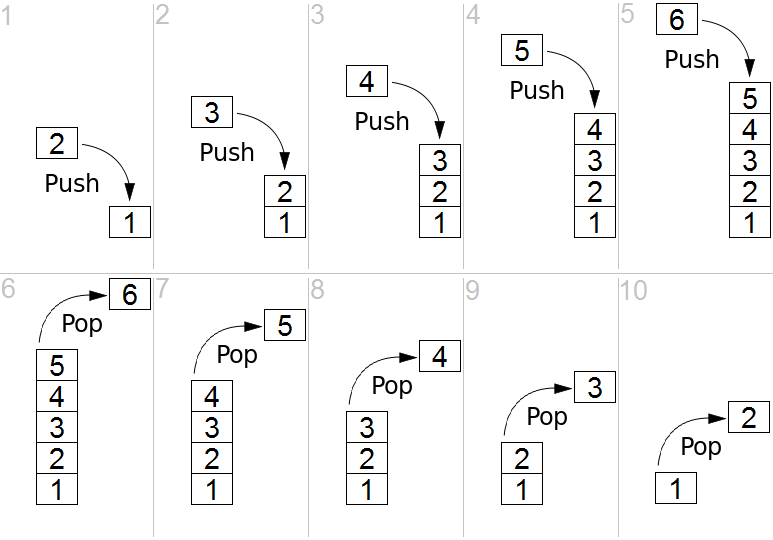

Reverse engineering the Intel FSP… a primer guide!
==================================================

### [Youness Alaoui](https://puri.sm/posts/author/_kakaroto/)

Hardware enablement developer

Recently, I’ve finished **reverse engineering the Intel FSP-S “entry” code,** that is from the entry point (FspSiliconInit) all the way to the end of the function and all the subfunctions that it calls. This is only some initial foray into reverse engineering the FSP as a whole, but reverse engineering is something that takes a lot of time and effort. Today’s blog post is here to illustrate that, and to lay the foundations for understanding what I’ve done with the FSP code (in a future blog post).

Over the years, many people asked me to teach them what I do, or to explain to them how to reverse engineer assembly code in general. Sometimes I hear the infamous “How hard can it be?” catchphrase. Last week someone I was discussing with thought that the assembly language is just like a regular programming language, but in binary form—it’s easy to make that mistake if you’ve never seen what assembly is or looks like. Historically, I’ve always said that reverse engineering and ASM is “too complicated to explain” or that “If you need help to get started, then you won’t be able to finish it on your own” and various other vague responses—I often wanted to explain to others why I said things like that but I never found a way to do it. You see, when something is complex, it’s easy to say that it’s complex, but it’s much harder to explain to people *why* it’s complex.

I was lucky to recently stumble onto a little function while reverse engineering the Intel FSP, a function that was both simple and complex, where figuring out what it does was an interesting challenge that I can easily walk you through. This function wasn’t a difficult thing to understand, and by far, it’s not one of the hard or complex things to reverse engineer, but this one is “small and complex enough” that it’s a perfect example to explain, without writing an entire book or getting into the more complex aspects of reverse engineering. So **today’s post serves as a “primer” guide to reverse engineering** for all of those interested in the subject. **It is a required read in order to understand the next blog posts I would be writing about the Intel FSP.** Ready? Strap on your geek helmet and let’s get started!

**DISCLAIMER**: I might make false statements in the blog post below, some by mistake, some intentionally for the purpose of vulgarizing the explanations. For example, when I say below that there are 9 registers in X86, I know there are more (SSE, FPU, or even just the DS or EFLAGS registers, or purposefully not mentioning EAX instead of RAX, etc.), but I just don’t want to complicate matters by going too wide in my explanations.

A prelude
=========

First things first, you need to understand some basic concepts, such as “what is ASM exactly”. I will explain some basic concepts but not *all* the basic concepts you might need. I will assume that you know at least what a programming language is and know how to write a simple “hello world” in at least one language, otherwise you’ll be completely lost.

So, ASM is the Assembly language, but it’s not the actual binary code that executes on the machine. It is however, very similar to it. To be more exact, the assembly language is a textual representation of the binary instructions given to the microprocessor. You see, when you compile your regular C program into an executable, the compiler will transform all your code into some very, very, very basic instructions. Those instructions are what the CPU will understand and execute. By combining a lot of small, simple and specific instructions, you can do more complex things. That’s the basis of any programming language, of course, but with assembly, the building blocks that you get are very limited. Before I’ll talk about instructions, I want to explain two concepts first which you’ll need to follow the rest of the story.

The stack
---------

First I’ll explain what “the stack” is.  You may have heard of it before, or maybe you didn’t, but the important thing to know is that when you write code, you have two types of memory:\* The first one is your “dynamic memory”, that’s when you call ‘malloc’ or ‘new’ to allocate new memory, this goes from your RAM upward (or left-to-right), in the sense that if you allocate 10 bytes, you’ll first get address 0x1000 for example, then when you allocate another 30 bytes, you’ll get address 0x100A, then if you allocate another 16 bytes, you’ll get 0x1028, etc.

-   The second type of memory that you have access to is the *stack,* which is different, instead it grows downward (or right-to-left), and it’s used to store local variables in a function. So if you start with the stack at address 0x8000, then when you enter a function with 16 bytes worth of local variables, your stack now points to address 0x7FF0, then you enter another function with 64 bytes worth of local variables, and your stack now points to address 0x7FB0, etc. The way the stack works is by “stacking” data into it, you “push” data in the stack, which puts the variable/data into the stack and moves the stack pointer down, you can’t remove an item from anywhere in the stack, you can always only remove (pop) the last item you added (pushed). A stack is actually an abstract type of data, like a list, an array, a dictionary, etc. You can read more about what a stack is on [wikipedia](ttps://en.wikipedia.org/wiki/Stack_(abstract_data_type)) and it shows you how you can add and remove items on a stack with this image:

The image shows you what we call a LIFO (Last-In-First-Out) and that’s what a stack is. In the case of the computer’s stack, it grows downward in the RAM (as opposed to upward in the above image) and is used to store local variables as well as the return address for your function (the instruction that comes after the call to your function in the parent function). So when you look at a stack, you will see multiple “frames”, you’ll see your current function’s stack with all its variables, then the return address of the function that called it, and above it, you’ll see the previous function’s frame with its own variables and the address of the function that called it, and above, etc. all the way to the main function which resides at the top of the stack.

Here is another image that exemplifies this:

The registers
-------------

The second thing I want you to understand is that the processor has multiple “registers”. You can think of a register as a variable, but there are only 9 total registers on x86, with only 7 of them usable. So, on the x86 processor, the various registers are: EAX, EBX, ECX, EDX, EDI, ESI, EBP, ESP, EIP.

There are two registers in there that are special:\* The EIP (Instruction Pointer) contains the address of the current instruction being executed.

-   The ESP (Stack Pointer) contains the address of the stack.

Access to the registers is extremely fast when compared to accessing the data in the RAM (the stack also resides on the RAM, but towards the end of it) and most operations (instructions) have to happen on registers. You’ll understand more when you read below about instructions, but basically, you can’t use an instruction to say “add value A to value B and store it into address C”, you’d need to say “move value A into register EAX, then move value B into register EBX, then add register EAX to register EBX and store the result in register ECX, then store the value of register ECX into the address C”.

The instructions
----------------

Let’s go back to explaining instructions now. As I explained before, the instructions are the basic building blocks of the programs, and they are very simple, they take the form of:

INS OP1, OP2, OP3

Where “INS” is the instruction”, and OP1, OP2, OP3 is what we call the “operand”, most instructions will only take 2 operands, some will take no operands, some will take one operand and others will take 3 operands. The operands are usually registers. Sometimes, the operand can be an actual value (what we call an “immediate value”) like “1”, “2” or “3”, etc. and sometimes, the operand is a relative position from a register, like for example “\[%eax + 4\]” meaning the address pointed to by the %eax register + 4 bytes. We’ll see more of that shortly. For now, let’s give you the list of the most common and used instructions:\* “[MOV](https://web.archive.org/web/20180404185045/https://x86.puri.sm/html/file_module_x86_id_176.html)“: move data from one operand into another

-   “[ADD](https://web.archive.org/web/20180404185045/https://x86.puri.sm/html/file_module_x86_id_5.html)/[SUB](https://web.archive.org/web/20180404185045/https://x86.puri.sm/html/file_module_x86_id_308.html)/[MUL](https://web.archive.org/web/20180404185045/https://x86.puri.sm/html/file_module_x86_id_210.html)/[DIV](https://web.archive.org/web/20180404185045/https://x86.puri.sm/html/file_module_x86_id_72.html)“: Add, Substract, Multiply, Divide one operand with another and store the result in a register
-   “[AND](https://web.archive.org/web/20180404185045/https://x86.puri.sm/html/file_module_x86_id_12.html)/[OR](https://web.archive.org/web/20180404185045/https://x86.puri.sm/html/file_module_x86_id_219.html)/[XOR](https://web.archive.org/web/20180404185045/https://x86.puri.sm/html/file_module_x86_id_330.html)/[NOT](https://web.archive.org/web/20180404185045/https://x86.puri.sm/html/file_module_x86_id_218.html)/[NEG](https://web.archive.org/web/20180404185045/https://x86.puri.sm/html/file_module_x86_id_216.html)“: Perform logical and/or/xor/not/negate operations on the operand
-   “[SHL](https://web.archive.org/web/20180404185045/https://x86.puri.sm/html/file_module_x86_id_285.html)/[SHR](https://web.archive.org/web/20180404185045/https://x86.puri.sm/html/file_module_x86_id_285.html)“: Shift Left/Shift Right the bits in the operand
-   “[CMP](https://web.archive.org/web/20180404185045/https://x86.puri.sm/html/file_module_x86_id_35.html)/[TEST](https://web.archive.org/web/20180404185045/https://x86.puri.sm/html/file_module_x86_id_315.html)“: Compare one register with an operand
-   “[JMP](https://web.archive.org/web/20180404185045/https://x86.puri.sm/html/file_module_x86_id_147.html)/[JZ](https://web.archive.org/web/20180404185045/https://x86.puri.sm/html/file_module_x86_id_146.html)/[JNZ](https://web.archive.org/web/20180404185045/https://x86.puri.sm/html/file_module_x86_id_146.html)/[JB](https://web.archive.org/web/20180404185045/https://x86.puri.sm/html/file_module_x86_id_146.html)/[JS](https://web.archive.org/web/20180404185045/https://x86.puri.sm/html/file_module_x86_id_146.html)/[etc](https://web.archive.org/web/20180404185045/https://x86.puri.sm/html/file_module_x86_id_146.html).”: Jump to another instruction (Jump unconditionally, Jump if Zero, Jump if Not Zero, Jump if Below, Jump if Sign, etc.)
-   “[PUSH](https://web.archive.org/web/20180404185045/https://x86.puri.sm/html/file_module_x86_id_269.html)/[POP](https://web.archive.org/web/20180404185045/https://x86.puri.sm/html/file_module_x86_id_248.html)“: Push an operand into the stack, or pop a value from the stack into a register
-   “[CALL](https://web.archive.org/web/20180404185045/https://x86.puri.sm/html/file_module_x86_id_26.html)“: Call a function. This is the equivalent of doing a “PUSH %EIP+4” + “JMP”. I’ll get into calling conventions later..
-   “[RET](https://web.archive.org/web/20180404185045/https://x86.puri.sm/html/file_module_x86_id_280.html)“: Return from a function. This is the equivalent of doing a “POP %EIP”

That’s about it, that’s what most programs are doing. Of course, there’s a lot more instructions, you can see a full list [here](https://web.archive.org/web/20180404185045/https://x86.puri.sm/), but you’ll see that most of the other instructions are very obscure or very specific or variations on the above instructions, so really, this represents most of the instructions you’ll ever encounter.

I want to explain one thing before we go further down: there is an additional register I didn’t mention before called the [FLAGS register](https://en.wikipedia.org/wiki/FLAGS_register), which is basically just a status register that contains “flags” that indicate when some arithmetic condition happened on the last arithmetic operation. For example, if you add 1 to 0xFFFFFFFF, it will give you ‘0’ but the “[Overflow flag](https://en.wikipedia.org/wiki/Overflow_flag)” will be set in the FLAGS register. If you substract 5 from 0, it will give you 0xFFFFFFFB and the “[Sign flag](https://en.wikipedia.org/wiki/Sign_flag)” will be set because the result is negative, and if you substract 3 from 3, the result will be zero and the “[Zero flag](https://en.wikipedia.org/wiki/Zero_flag)” will be set.

I’ve shown you the “CMP” instruction which is used to compare a register with an operand, but you might be wondering, “What does it mean exactly to ‘compare’?” Well, it’s simple, the CMP instruction is the same thing as the SUB instruction, in that, it substracts one operand from another, but the difference is that it doesn’t store the result anywhere. However, it does get your flags updated in the FLAGS register. For example, if I wanted to compare %EAX register with the value ‘2’, and %EAX contains the value 3, this is what’s going to happen: you will substract 2 from the value, the result will be 1, but you don’t care about that, what you care about is that the ZF (Zero flag) is not set, and the SF (Sign flag is not set), which means that %eax and ‘2’ are not equal (otherwise, ZF would be set), and that the value in %eax is superior to 2 (because SF is not set), so you know that “%eax &gt; 2” and that’s what the CMP does.

The TEST instruction is very similar but it does a logical AND on the two operands for testing, so it’s used for comparing logical values instead of arithmetic values (“TEST %eax, 1” can be used to check if %eax contains an odd or even number for example).

This is useful because the next bunch of instructions I explained in the list above is conditional Jump instructions, like “JZ” (jump if zero) or “JB” (jump if below), or “JS” (jump if sign), etc. This is what is used to implement “if, for, while, switch/case, etc.” it’s as simple as doing a “CMP” followed by a “JZ” or “JNZ” or “JB”, “JA”, “JS”, etc.

And if you’re wondering what’s the difference between a “Jump if below” and “Jump if sign” and “Jump if lower”, since they all mean that the comparison gave a negative result, right? Well, the “jump if below” is used for unsigned integers, while “jump if lower” is used for signed integers, while “jump if sign” can be misleading. An unsigned 3 – 4 would give us a very high positive result…  something like that, in practice, JB checks the [Carry Flag](https://en.wikipedia.org/wiki/Carry_flag), while JS checks the [Sign Flag](https://en.wikipedia.org/wiki/Sign_flag) and JL checks if the Sign Flag is equal to the [Overflow flag](https://en.wikipedia.org/wiki/Overflow_flag). See the [Conditional Jump](https://web.archive.org/web/20180404185045/https://x86.puri.sm/html/file_module_x86_id_146.html) page for more details.

A practical example
-------------------

Here’s a very small and simple practical example, if you have a simple C program like this:

int main() {    return add\_a\_and\_b(2, 3); }

int add\_a\_and\_b(int a, int b) {    return a + b; }

It would compile into something like this:

\_main:    push   3 ; Push the second argument '3' into the stack    push   2 ; Push the first argument '2' into the stack    call   \_add\_a\_and\_b ; Call the \_add\_a\_and\_b function. This will put the address of the next

`                          ; instruction (add) into the stack, then it will jump into the _add_a_and_b`
`                          ; function by putting the address of the first instruction in the _add_a_and_b`
`                          ; label (push %ebx) into the EIP register`
`  add    %esp, 8          ; Add 8 to the esp, which effectively pops out the two values we just pushed into it`

   ret ; Return to the parent function....

\_add\_a\_and\_b:    push   %ebx ; We're going to modify %ebx, so we need to push it to the stack

`                          ; so we can restore its value when we're done`

   mov %eax, \[%esp+8\] ; Move the first argument (8 bytes above the stack pointer) into EAX    mov %ebx, \[%esp+12\] ; Move the second argument (12 bytes above the stack pointer) into EBX    add %eax, %ebx ; Add EAX and EBX and store the result into EAX    pop %ebx ; Pop EBX to restore its previous value    ret ; Return back into the main. This will pop the value on the stack (which was

`                          ; the address of the next instruction in the main function that was pushed into`
`                          ; the stack when the 'call' instruction was executed) into the EIP register`

Yep, something as simple as that, can be quite complicated in assembly. Well, it’s not really that complicated actually, but a couple of things can be confusing.

You have only 7 usable registers, and one stack. Every function gets its arguments passed through the stack, and can return its return value through the %eax register. If every function modified every register, then your code will break, so every function has to ensure that the other registers are unmodified when it returns (other than %eax). You pass the arguments on the stack and your return value through %eax, so what should you do if need to use a register in your function? Easy: you keep a copy on the stack of any registers you’re going to modify so you can restore them at the end of your function. In the \_*add\_a\_and\_b *function, I did that for the %ebx register as you can see. For more complex function, it can get a lot more complicated than that, but let’s not get into that for now (for the curious: compilers will create what we call a “prologue” and an “epilogue” in each function. In the prologue, you store the registers you’re going to modify, set up the %ebp (base pointer) register to point to the base of the stack when your function was entered, which allows you to access things without keeping track of the pushes/pops you do throughout the function, then in the epilogue, you pop the registers back, restore %esp to the value that was saved in %ebp, before you return).

The second thing you might be wondering about is with these lines:

mov %eax, \[%esp+8\] mov %ebx, \[%esp+12\]

And to explain it, I will simply show you this drawing of the stack’s contents when we call those two instructions above:

For the purposes of this exercise, we’re going to assume that the \_main function is located in memory at the address 0xFFFF0000, and that each instructoin is 4 bytes long (the size of each instruction can vary depending on the instruction and on its operands). So you can see, we first pushed 3 into the stack, %esp was lowered, then we pushed 2 into the stack, %esp was lowered, then we did a ‘call \_add\_a\_and\_b’, which stored the address of the next instruction (4 instructions into the main, so ‘\_main+16’) into the stack and esp was lowered, then we pushed %ebx, which I assumed here contained a value of 0, and the %esp was lowered again. If we now wanted to access the first argument to the function (2), we need to access %esp+8, which will let us skip the saved %ebx and the ‘Return address’ that are in the stack (since we’re working with 32 bits, each value is 4 bytes). And in order to access the second argument (3), we need to access %esp+12.

Binary or assembly?
-------------------

One question that may (or may not) be popping into your mind now is “wait, isn’t this supposed to be the ‘computer language’, so why isn’t this binary?” Well, it is… in a way. As I explained earlier, “the assembly language is a textual representation of the binary instructions given to the microprocessor”, what it means is that those instructions are given to the processor as is, there is no transformation of the instructions or operands or anything like that. However, the instructions are given to the microprocessor in binary form, and the text you see above is just the textual representation of it.. kind of like how “68 65 6c 6c 6f” is the hexadecimal representation of the ASCII text “hello”. What this means is that each instruction in assembly language, which we call a ‘mnemonic’ represents a binary instruction, which we call an ‘opcode’, and you can see the opcodes and mnemonics in the [list](https://web.archive.org/web/20180404185045/https://x86.puri.sm/) of x86 instructions I gave you above. Let’s take the [CALL](https://web.archive.org/web/20180404185045/https://x86.puri.sm/html/file_module_x86_id_26.html) instruction for example. The opcode/mnemonic list is shown as:

|            |                   |                                                                  |
|:----------:|:-----------------:|:----------------------------------------------------------------:|
| **Opcode** |    **Mnemonic**   |                          **Description**                         |
|  | `E8 cw` |   | `CALL rel16`  | | Call near, relative, displacement relative to next instruction |
|  | `E8 cd` |   | `CALL rel32`  | | Call near, relative, displacement relative to next instruction |
|  | `FF /2` |   | `CALL r/m16`  |      | Call near, absolute indirect, address given in r/m16      |
|  | `FF /2` |   | `CALL r/m32`  |      | Call near, absolute indirect, address given in r/m32      |
|  | `9A cd` | | `CALL ptr16:16` |          | Call far, absolute, address given in operand          |
|  | `9A cp` | | `CALL ptr16:32` |          | Call far, absolute, address given in operand          |
|  | `FF /3` |  | `CALL m16:16`  |      | Call far, absolute indirect, address given in m16:16      |
|  | `FF /3` |  | `CALL m16:32`  |      | Call far, absolute indirect, address given in m16:32      |
||

This means that this same “CALL” mnemonic can have multiple addresses to call. Actually, there are four different possitiblities, each having a 16 bits and a 32 bits variant. The first possibility is to call a function with a relative displacement (Call the function 100 bytes below this current position), or an absolute address given in a register (Call the function whose address is stored in %eax) or an absolute address given as a pointer (Call the function at address 0xFFFF0100), or an absolute address given as an offset to a segment (I won’t explain segments now). In our example above, the “call \_add\_a\_and\_b” was probably stored as a call relative to the current position with 12 bytes below the current instruction (4 bytes per instruction, and we have the CALL, ADD, RET instructions to skip). This means that the instruction in the binary file was encoded as “E8 00 00 00 0C” (The E8 opcode to mean a “CALL near, relative”, and the “00 00 00 0C” to mean 12 bytes relative to the current instruction). Now, the most observant of you have probably noticed that this CALL instruction takes 5 bytes total, not 4, but as I said above, we will assume it’s 4 bytes per instruction just for the sake of keeping things simple, but yes, the CALL (in this case) is 5 bytes, and other instructions will sometimes have more or less bytes as well.

I chose the CALL function above for example, because I think it’s the least complicated to explain.. other instructions have even more complicated opcodes and operands (See the [ADD](https://web.archive.org/web/20180404185045/https://x86.puri.sm/html/file_module_x86_id_5.html) and [ADC](https://web.archive.org/web/20180404185045/https://x86.puri.sm/html/file_module_x86_id_4.html) (Add with Cary) instructions for example, you’ll notice the same opcodes shared between them even, so they are the same instruction, but it’s easy to give them separate mnemonics to differentiate their behaviors).

Here’s a screenshot showing a side by side view of the Assembly of a function with the hexadecimal view of the binary:

As you can see, I have my cursor on address 0xFFF6E1D6 on the assembly view on the left, which is also highlighted on the hex view on the right. That address is a CALL instruction, and you can see the equivalent hex of “E8 B4 00 00 00”, which means it’s a CALL near, relative (E8 being the opcode for it) and the function is 0xB4 (180) bytes below our current position of 0xFFF6E1D6.

If you open the file with a hexadecimal editor, you’ll only see the hex view on the right, but you need to put the file into a Disassembler (such as the IDA disassembler which I’m using here, but there are cheaper alternatives as well, [the list](https://en.wikibooks.org/wiki/X86_Disassembly/Disassemblers_and_Decompilers) can be long), and the disassembler will interpret those binary opcodes to show you the textual assembly representation which is much much easier to read.

Some actual reverse engineering
===============================

Now that you have the basics, let’s do a quick reverse engineering exercise… This is a very simple function that I’ve reversed recently, it comes from the SiliconInit part of the FSP, and it’s used to validated the UPD configuration structure (used to tell it what to do).

Here is the Assembly code for that function:

This was disassembled using [IDA](https://www.hex-rays.com/products/ida/) 7.0 (The Interactive DisAssembler) which is an incredible (but expensive) piece of software. There are other disassemblers which can do similar jobs, but I prefer IDA personally. Let’s first explain what you see on the screen.

On the left side, you see “seg000:FFF40xxx” this means that we are in the segment “seg000” at the address 0xFFF40xxx. I won’t explain what a segment is, because you don’t need to know it. The *validate\_upd\_config* function starts at address 0xFFF40311 in the RAM, and there’s not much else to understand. You can see how the address increases from one instruction to the next, it can help you calculate the size in bytes that each instruction takes in RAM for example, if you’re curious of course… (the XOR is 2 bytes, the CMP is 2 bytes, etc.).

As you’ve seen in my previous example, anything after a semicolon (“;”) is considered a comment and can be ignored. The “CODE XREF” comments are added by IDA to tell us that this code has a cross-references (is being called by) some other code. So when you see “CODE XREF: validate\_upd\_config+9” (at 0xFF40363, the RETN instruction), it means this instruction is being called (referenced by) from the function validate\_upd\_config and the “+9” means 9 bytes into the function (so since the function starts at 0xFFF40311, it means it’s being called from the instruction at offset 0xFFF4031A. The little “up” arrow next to it means that it comes from above the current position in the code, and if you follow the grey lines on the left side of the screen, you can follow that call up to the address 0xFFF4031A which contains the instruction “jnz short locret\_FFF40363”. I assume the “j” letter right after the up arrow is to tell us that the reference comes from a “jump” instruction.

As you can see in the left side of the screen, there are a lot of arrows, that means that there’s a lot of jumping around in the code, even though it’s not immediatly obvious. The awesome IDA software has a “layout view” which gives us a much nicer view of the code, and it looks like this:

Now you can see each block of code separately in their own little boxes, with arrows linking all of the boxes together whenever a jump happens. The green arrows mean that it’s a conditional jump when the condition is successful, while the red arrows means the condition was not successful. This means that a “JZ” will show a green arrow towards the code it would jump to if the result is indeed zero, and a red arrow towards the block where the result is not zero. A blue arrow means that it’s an unconditional jump.

I usually always do my reverse engineering using the layout view, I find it much easier to read/follow, but for the purpose of this exercise, I will use the regular linear view instead, so I think it will be easier for you to follow with that instead. The reason is mostly because the layout view doesn’t display the address of each instruction, and it’s easier to have you follow along if I can point out exactly which instruction I’m looking it by mentioning its address.

Now that you know how to read the assembly code, you understand the various instructions, I feel you should be ready to reverse engineering this very simple assembly code (even though it might seem complex at first). I just need to give you the following hints first:\* Because I’ve already reversed engineering it, you get the beautiful name “validate\_upd\_config” for the function, but technically, it was simply called “sub\_FFF40311”

-   I had already reverse engineered the function that called it so I know that this function is receiving its arguments in an unusual way. The arguments aren’t pushed to the stack, instead, the first argument is stored in %ecx, and the second argument is stored in %edx
-   The first argument (%ecx, remember?) is an enum to indicate what type of UPD structure to validate, let me help you out and say that type ‘3’ is the FSPM\_UPD (The configuration structure for the FSPM, the MemoryInit function), and that type ‘5’ is the FSPS\_UPD (The configuration structure for the FSPS, the SiliconInit function).
-   Reverse engineering is really about reading one line at a time, in a sequential manner, keep track of which blocks you reversed and be patient. You can’t look at it and expect to understand the function by viewing the big picture.
-   It is very very useful in this case to have a dual monitor, so you can have one monitor for the assembly, and the other monitor for your C code editor. In my case, I actually recently bought an ultra-wide monitor and I split screen between my IDA window and my emacs window and it’s great. It’s hard otherwise to keep going back and forth between the assembly and the C code. That being said, I would suggest you do the same thing here and have a window on the side showing you the assembly image above (not the layout view) while you read the explanation on how to reverse engineer it below.

Got it? All done? No? Stop sweating and hyperventilating… I’ll explain exactly how to reverse engineer this function in the next paragraph, and you will see how simple it turns out to be!

Let’s get started!
------------------

The first thing I do is write the function in C. Since I know the name and its arguments already, I’ll do that:

void validate\_upd\_config (uint8\_t action, void \*config) { }

Yeah, there’s not much to it yet, and I set it to return “void” because I don’t know if it returns anything else, and I gave the first argument “action” as a “uint8\_t” because in the parent function it’s used a single byte register (I won’t explain for now how to differentiate 1-byte, 2-bytes, 4-bytes and 8-bytes registers). The second argument is a pointer, but I don’t know it’s a pointer to what kind of structure exactly, so I just set it as a *void \**.

The first instruction is a “xor eax, eax”. What does this do? It XORs the eax register with the eax register and stores the result in the eax register itself, which is the same thing as “mov eax, 0”, because *1 XOR 1= 0* and *0 XOR 0 = 0*, so if every bit in the eax register is logically XORed with itself, it will give 0 for the result. If you’re asking yourself “Why did the compiler decide to do ‘xor eax, eax’ instead of ‘mov eax, 0’ ?” then the answer is simple: “Because it takes less CPU clock cycles to do a XOR, than to do a move”, which means it’s more optimized and it will run faster. Besides, the XOR takes 2 bytes as you can see above (the address of the instructions jumped from FFF40311 to FFF40313), while a “mov eax, 0” would have taken 5 bytes. So it also helps keep the code smaller.

Alright, so now we know that eax is equal to 0, let’s keep that in mind and move along (I like to keep track of things like that as comments in my C code). Next instruction does a “cmp ecx, 3”, so it’s comparing ecx, which we already know is our first argument (uint8\_t action), ok, it’s a comparison, not much to do here, again let’s keep that in mind and continue… the next instruction does a “jnz short loc\_FFF40344”, which is more interesting, so if the previous comparison is NOT ZERO, then jump to the label loc\_FFF40344 (for now ignore the “short”, it just helps us differentiate between the various mnemonics, and it means that the jump is a relative offset that fits in a “short word” which means 2 bytes, and you can confirm that the jnz instruction does indeed take only 2 bytes of code). Great, so there’s a jump if the result is NOT ZERO, which means that if the result is zero, the code will just continue, which means if the ecx register (action variable) is EQUAL (substraction is zero) to 3, the code will continue down to the next instruction instead of jumping… let’s do that, and in the meantime we’ll update our C code:

void validate\_upd\_config (uint8\_t action, void \*config) {

`  // eax = 0`
`  if (action == 3) {`
`     // 0xFFF40318 `
`  } else {`
`     // loc_FFF40344`
`  }`

}

The next instruction is “test edx, edx”.  We know that the edx register is our second argument which is the pointer to the configuration structure. As I explained above, the “test” is just like a comparison, but it does an AND instead of a substraction, so basically, you AND edx with itself.. well, of course, that has no consequence, *1 AND 1 = 1*, and *0 AND 0 = 0*, so why is it useful to test a register against itself? Simply because the TEST will update our FLAGS register… so when the next instruction is “JZ” it basically means “Jump if the edx register was zero”… And yes, doing a “TEST edx, edx”  is more optimized than doing a “CMP edx, 0”, you’re starting to catch on, yeay!

And indeed, the next instruction is “jz locret\_FFF40363”, so if the edx register is ZERO, then jump to locret\_FFF40363, and if we look at that locret\_FFF40363, it’s a very simple “retn” instruction. So our code becomes:

void validate\_upd\_config (uint8\_t action, void \*config) {

` // eax = 0`
` if (action == 3) {`
`   if (config == NULL)`
`      return; `
` } else {`
`   // loc_FFF40344`
` }`

}

Next! Now it gets slightly more complicated… the instruction is: “cmp dword ptr \[edx\], 554C424Bh”, which means we do a comparison of a dword (4 bytes), of the data pointed to by the pointer edx, with no offset (“\[edx\]” is the same as saying “edx\[0\]” if it was a C array for example), and we compare it to the value 554C424Bh… the “h” at the end means it’s a hexadecimal value, and with experience you can quickly notice that the hexadecimal value is all within the ASCII range, so using a Hex to ASCII converter, we realize that those 4 bytes represent the ASCII letters “KBLU” (which is why I manually added them as a comment to that instruction, so I won’t forget). So basically the instruction compares the first 4 bytes of the structure (the content pointed to by the edx pointer) to the string “KBLU”. The next instruction does a “jnz loc\_FFF4035E” which means that if the comparison result is NOT ZERO (so, if they are not equal) we jump to loc\_FFF4035E.

Instead of continuing sequentially, I will see what that loc\_FFF4035E contains (of course, I did the same thing in all the previous jumps, and had to decide if I wanted to continue reverse engineering the jump or the next instruction, in this case, it seems better for me to jump, you’ll see why soon). The loc\_FFF4035E label contains the following instruction: “mov, eax, 80000002h”, which means it stores the value 0x80000002 into the eax register, and then it jumps to (not really, it just naturally flows to the next instruction which happens to be the label) locret\_FFF40363, which is just a “retn”. This makes our code into this:

uint32\_t validate\_upd\_config (uint8\_t action, void \*config) {

` // eax = 0`
` if (action == 3) {`
`   if (config == NULL)`
`      return 0; `
`   if (((uint32_t *)config)[0] != 0x554C524B)`
`      return 0x80000002;`
` } else {`
`   // loc_FFF40344`
` }`

}

The observant here will notice that I’ve changed the function prototype to return a uint32\_t instead of “void” and my previous “return” has become “return 0” and the new code has a “return 0x80000002”. That’s because I realized at this point that the “eax” register is used to return a uint32\_t value. And since the first instruction was “xor eax, eax”, and we kept in the back of our mind that “eax is initialized to 0”, it means that the use case with the (config == NULL) will return 0. That’s why I made all these changes…

Very well, let’s go back to where we were, since we’ve exhausted this jump, we’ll jump back in reverse to go back to the address FFF40322 and continue from there to the next instruction. It’s a “cmp dword ptr \[edx+4\], 4D5F4450h”, which compares the dword at edx+4 to 0x4D5F4450, which I know to be the ASCII for “PD\_M”; this means that the last 3 instructions are used to compare the first 8 bytes of our pointer to “KBLUPD\_M”… ohhh, light bulb above our heads, it’s comparing the pointer to the Signature of the FSPM\_UPD structure (don’t forget, you weren’t supposed to know that the function is called validate\_upd\_config, or that the argument is a config pointer… just that it’s a pointer)! OK, now it makes sense, and while we’re at it—and since we are, of course, reading the FSP integration guide PDF, we then also realize what the 0x80000002 actually means. At this point, our code now becomes:

EFI\_STATUS validate\_upd\_config (uint8\_t action, void \*config) {

` if (action == 3) {`
`   FSPM_UPD *upd = (FSPM_UPD *) config;`
`   if (upd == NULL)`
`      return EFI_SUCCESS; `
`   if (upd->FspUpdHeader.Signature != 0x4D5F4450554C524B /* 'KBLUPD_M'*/)`
`      return EFI_INVALID_PARAMETERS;`
` } else {`
`   // loc_FFF40344`
` }`

}

Yay, this is starting to look like something… Now you probably got the hang of it, so let’s do things a little faster now.\* The next line “cmp \[edx+28h\], eax” compares edx+0x28 to eax. Thankfully, we know now that edx points to the FSPM\_UPD structure, and we can calculate that at offset 0x28 inside that structure, it’s the field StackBase within the FspmArchUpd field…

-   and also, we still have in the back of our minds that ‘eax’ is initialized to zero, so, we know that the next 2 instructions are just checking if upd-&gt;FspmArchUpd.StackBase is == NULL.
-   Then we compare the StackSize with 0x26000, but the comparison is using “jb” for the jump, which is “jump if below”, so it checks if StackSize &lt; 0x26000,
-   finally it does a “test” with “edx+30h” (which is the BootloaderTolumSize field) and 0xFFF, then it does an unconditional jump to loc\_FFF4035C, which itself does a “jz” to the return..
-   which means if (BootloaderTolumSize  & 0xFFF  == 0) it will return whatever EAX contained (which is zero),
-   but if it doesn’t, then it will continue to the next instruction which is the “mov eax, 80000002h”.

So, we end up with this code:

EFI\_STATUS validate\_upd\_config (uint8\_t action, void \*config) {

` // eax = 0`
` if (action == 3) {`
`   FSPM_UPD *upd = (FSPM_UPD *) config;`
`   if (upd == NULL)`
`      return 0;`
`   if (upd->FspUpdHeader.Signature != 0x4D5F4450554C524B /* 'KBLUPD_M'*/)`
`      return EFI_INVALID_PARAMETERS;`
`   if (upd->FspmArchUpd.StackBase == NULL)`
`       return EFI_INVALID_PARAMETERS;`
`   if (upd->FspmArchUpd.StackSize < 0x2600)`
`       return EFI_INVALID_PARAMETERS;`
`   if (upd->FspmArchUpd.BootloaderTolumSize & 0xFFF)`
`       return EFI_INVALID_PARAMETERS;`
` } else {`
`   // loc_FFF40344`
` }`
` return EFI_SUCCESS`

}

Great, we just solved half of our code! Don’t forget, we jumped one way instead of another at the start of the function, now we need to go back up and explore the second branch of the code (at offset 0xFFF40344). The code is very similar, but it checks for “KBLUPD\_S” Signature, and nothing else. Now we can also remove any comment/notes we have (such as the note that eax is initialized to 0) and clean up, and simplify the code if there is a need.

So our function ends up being (this is the final version of the function):

EFI\_STATUS validate\_upd\_config (uint8\_t action, void \*config) {

` if (action == 3) {`
`   FSPM_UPD *upd = (FSPM_UPD *) config;`
`   if (upd == NULL)`
`      return EFI_SUCCESS;`
`   if (upd->FspUpdHeader.Signature != 0x4D5F4450554C524B /* 'KBLUPD_M'*/)`
`      return EFI_INVALID_PARAMETERS;`
`   if (upd->FspmArchUpd.StackBase == NULL)`
`       return EFI_INVALID_PARAMETERS;`
`   if (upd->FspmArchUpd.StackSize < 0x2600)`
`       return EFI_INVALID_PARAMETERS;`
`   if (upd->FspmArchUpd.BootloaderTolumSize & 0xFFF)`
`       return EFI_INVALID_PARAMETERS;`
` } else {`
`   FSPS_UPD *upd = (FSPS_UPD *) config;`
`   if (upd == NULL)`
`       return EFI_SUCCESS;`
`   if (upd->FspUpdHeader.Signature != 0x535F4450554C524B /* 'KBLUPD_S'*/)`
`       return EFI_INVALID_PARAMETERS;`
` }`
` return EFI_SUCCESS`

}

Now this wasn’t so bad, was it? I mean, it’s time consuming, sure, it can be a little disorienting if you’re not used to it, and you have to keep track of which branches (which blocks in the layout view) you’ve already gone through, etc. but the function turned out to be quite small and simple. After all, it was mostly only doing CMP/TEST and JZ/JNZ.

That’s pretty much all I do when I do my reverse engineering, I go line by line, I understand what it does, I try to figure out how it fits into the bigger picture, I write equivalent C code to keep track of what I’m doing and to be able to understand what happens, so that I can later figure out what the function does exactly… Now try to imagine doing that for hundreds of functions, some of them that look like this (random function taken from the FSPM module):

You can see on the right, the graph overview which shows the entirety of the function layout diagram. The part on the left (the assembly) is represented by the dotted square on the graph overview (near the middle). You will notice some arrows that are thicker than the others, that’s used in IDA to represent loops. On the left side, you can notice one such thick green line coming from the bottom and the arrow pointing to a block inside our view. This means that there’s a jump condition below that can jump back to a block that is above the current block and this is basically how you do a for/while loop with assembly, it’s just a normal jump that points backwards instead of forwards.

Finally, the challenge!
=======================

At the beginning of this post, I mentioned a challenging function to reverse engineer. It’s not extremely challenging—it’s complex enough that you can understand the kind of things I have to deal with sometimes, but it’s simple enough that anyone who was able to follow up until now should be able to understand it (and maybe even be able to reverse engineer it on their own).

So, without further ado, here’s this very simple function:

Since I’m a very nice person, I renamed the function so you won’t know what it does, and I removed my comments so it’s as virgin as it was when I first saw it. Try to reverse engineer it. Take your time, I’ll wait:

Alright, so, the first instruction is a “call $+5”, what does that even mean?\# When I looked at the hex dump, the instruction was simply “E8 00 00 00 00” which according to our previous [CALL opcode table](https://web.archive.org/web/20180404185045/https://x86.puri.sm/html/file_module_x86_id_26.html) means “Call near, relative, displacement relative to next instruction”, so it wants to call the instruction 0 bytes from the next instruction. Since the call opcode itself is taking 5 bytes, that means it’s doing a call to its own function but skipping the call itself, so it’s basically jumping to the “pop eax”, right? Yes…  but it’s not actually jumping to it, it’s “calling it”, which means that it just pushed into the stack the return address of the function… which means that our stack contains the address 0xFFF40244 and our next instruction to be executed is the one at the address 0xFFF40244. That’s because, if you remember, when we do a “ret”, it will pop the return address from the stack into the EIP (instruction pointer) register, that’s how it knows where to go back when the function finishes.

1.  So, then the instruction does a “pop eax” which will pop that return address into EAX, thus removing it from the stack and making the call above into a regular jump (since there is no return address in the stack anymore).
2.  Then it does a “sub eax, 0FFF40244h”, which means it’s substracting 0xFFF40244 from eax (which should contain 0xFFF40244), so eax now contains the value “0”, right? You bet!
3.  Then it adds to eax, the value “0xFFF4023F”, which is the address of our function itself. So, eax now contains the value 0xFFF4023F.
4.  It will then substract from EAX, the value pointed to by \[eax-15\], which means the dword (4 bytes) value at the offset 0xFFF4023F – 0xF, so the value at 0xFFF40230, right… that value is 0x1AB (yep, I know, you didn’t have this information)… so, 0xFFF4023F – 0x1AB = 0xFFF40094!
5.  And then the function returns.. with the value 0xFFF40094 in EAX, so it returns 0xFFF40094, which happens to be the pointer to the FSP\_INFO\_HEADER structure in the binary.

So, the function just returns 0xFFF40094, but why did it do it in such a convoluted way? The reason is simple: because the FSP-S code is technically meant to be loaded in RAM at the address 0xFFF40000, but it can actually reside anywhere in the RAM when it gets executed. Coreboot for example doesn’t load it in the right memory address when it executes it, so instead of returning the wrong address for the structure and crashing (remember, most of the jumps and calls use relative addresses, so the code should work regardless of where you put it in memory, but in this case returning the wrong address for a structure in memory wouldn’t work), the code tries to dynamically verify if it has been relocated and if it is, it will calculate how far away it is from where it’s supposed to be, and calculate where in memory the FSP\_INFO\_HEADER structure ended up being.

Here’s the explanation why:\* If the FSP was loaded into a different memory address, then the “call $+5” would put the exact memory address of the next instruction into the stack, so when you pop it into eax then substract from it the expected address 0xFFF40244, this means that eax will contain the **offset** from where it was supposed to be.

-   Above, we said eax would be equal to zero, yes, that’s true, but *only* in the usecase where the FSP is in the right memory address, as expected, otherwise, eax would simply contain the offset. Then you add to it 0xFFFF4023F which is the address of our function, and with the offset, that means eax now contains the exact memory address of the current function, wherever it was actually placed in RAM!
-   Then when it grabs the value 0x1AB (because that value is stored in RAM 15 bytes before the start of the function, that will work just fine) and substracts it from our current position, it gives us the address in RAM of the FSP\_INFO\_HEADER (because the compiler knows that the structure is located exactly 0x1AB bytes before the current function). This just makes everything be relative.

Isn’t that great!? ?? It’s so simple, but it does require some thinking to figure out what it does and some thinking to understand why it does it that way… but then you end up with the problem of “How do I write this in C”? Honestly, I don’t know how, I just wrote this in my C file:

// Use Position-independent code to make this relocatable void \*get\_fsp\_info\_header() {

`   return 0xFFF40094; `

}

I think the compiler takes care of doing all that magic on its own when you use the -fPIC compiler option (for gcc), which means “Position-Independent Code”.

What this means for Purism
==========================

On my side, **I’ve finished reverse engineering the FSP-S entry code**—from the entry point (FspSiliconInit) all the way to the end of the function and all the subfunctions that it calls.

This only represents 9 functions however, and about 115 lines of C code; I haven’t yet fully figured out where exactly it’s going in order to execute the rest of the code. What happens is that the last function it calls (it actually jumps into it) grabs a variable from some area in memory, and within that variable, it will copy a value into the ESP, thus replacing our stack pointer, and then it does a “RETN”… which means that it’s not actually returning to the function that called it (coreboot), it’s returning… “somewhere”, depending on what the new stack contains, but I don’t know where (or how) this new stack is created, so I need to track it down in order to find what the return address is, find where the “retn” is returning us into, so I can unlock plenty of new functions and continue reverse engineering this.

I’ve already made some progress on that front (I know where the new stack tells us to return into) but you will have to wait until my next blog post before I can explain it all to you. It’s long and complicated enough that it needs its own post, and this one is long enough already.

Other stories from strange lands
================================

You never really know what to expect when you start reverse engineering assembly. Here are some other stories from my past experiences.\* I once spent a few days reverse engineering a function until about 30% of it when I finally realized that the function was… the C++ “+ operator” of the std::string class (which by the way, with the use of C++ templates made it excruciatingly hard to understand)!

-   I once had to reverse engineer over 5000 lines of assembly code that all resolved into… 7 lines of C code. The code was for creating a hash and it was doing a lot of manipulation on data with different values on every iteration. There was a LOT of xor, or, and, shifting left and right of data, etc., which took maybe a hundred or so lines of assembly and it was all inside a loop, which the compiler decided that—to optimize it—it would unravel the loop (this means that instead of doing a jmp, it will just copy-paste the same code again), so instead of having to reverse engineer the code once and then see that it’s a loop that runs 64 times, I had to reverse engineer the same code 64 times because it was basically getting copy-pasted by the compiler in a single block but the compiler was “nice” enough that it was using completely different registers for every repetition of the loop, and the data was getting shifted in a weird way and using different constants and different variables at every iteration, and—as if that wasn’t enough— every 1/4th of the loop, changing the algorithm and making it very difficult to predict the pattern, forcing me to completely reverse engineer the 5000+ assembly lines into C, then slowly refactor and optimize the C code until it became that loop with 7 lines of code inside it… If you’re curious you can see the code [here](https://web.archive.org/web/20180404185045/https://github.com/tomhennigan/amsn/blob/master/amsn/utils/webcamsn/src/kidhash.c#L39) at line 39, where there is some operation common to all iterations, then 4 different operations depending on which iteration we are doing, and the variables used for each operation changes after each iteration (P, PP, PPP and PPPP get swapped every time), and the constant values and the indices used are different for each iteration as well (see [constants.h](https://web.archive.org/web/20180404185045/https://github.com/tomhennigan/amsn/blob/master/amsn/utils/webcamsn/src/constants.h)). It was complicated and took a long while to reverse engineer.
-   Below is the calling graph of the PS3 firmware I worked on some years ago. All of these functions have been entirely reverse engineered (each black rectangle is actually an entire function, and the arrows show which function calls which other function), and the result was the [ps3xport](https://web.archive.org/web/20180404185045/https://github.com/kakaroto/ps3xport) tool. As you can see, sometimes a function can be challenging to reverse, and sometimes a single function can call so many nested functions that it can get pretty complicated to keep track of what is doing what and how everything fits together. That function at the top of the graph was probably very simple, but it brought with it so much complexity because of a single “call”:

Perseverance prevails
=====================

In conclusion:\* Reverse engineering isn’t just about learning a new language, it’s a very different experience from “learning Java/Python/Rust after you’ve mastered C”, because of the way it works; it can sometimes be very easy and boring, sometimes it will be very challenging for a very simple piece of code.

-   It’s all about perseverance, being very careful (it’s easy to get lost or make a mistake, and very hard to track down and fix a mistake/typo if you make one), and being *very* patient. We’re talking days, weeks, *months.* That’s why reverse engineering is something that very few people do (compared to the number of people who do general software development). Remember also that our first example was 82 bytes of code, and the second one was only 19 bytes long, and most of the time, when you need to reverse engineer something, it’s many hundreds of KBs of code.

All that being said, the satisfaction you get when you finish reverse engineering some piece of code, when you *finally* understand how it works and can reproduce its functionality with open source software of your own, cannot be described with words. The feeling of achievement that you get makes all the efforts worth it!

I hope this write-up helps everyone get a fresh perspective on what it means to “reverse engineer the code”, why it takes so long, and why it’s rare to find someone with the skills, experience and patience to do this kind of stuff for months—as it can be frustrating, and we sometimes need to take a break from it and do something else in order to renew our brain cells.
